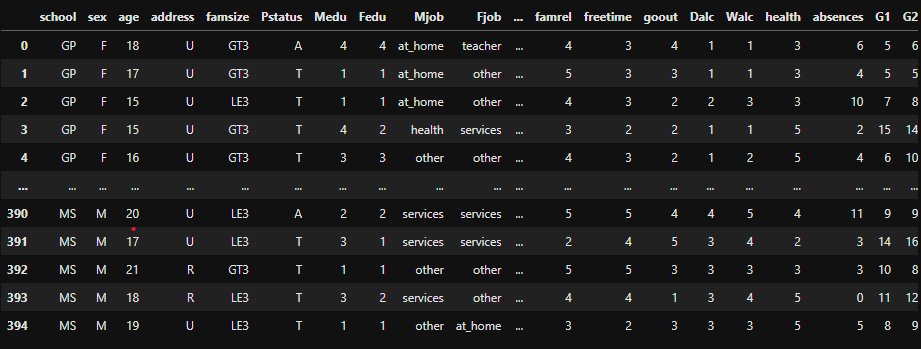
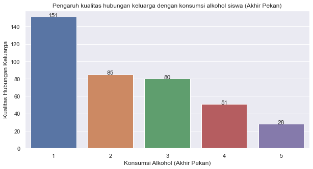
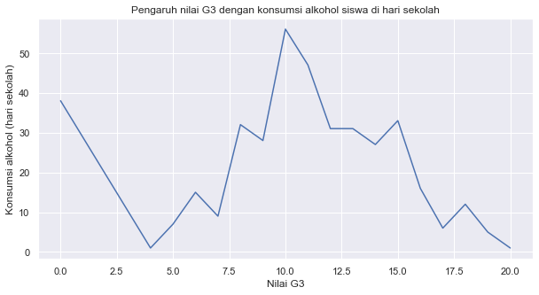

# Analysis of Student Alcohol Consumption in Portugal with EDA

By M. Attala R.

Dataset: Student Alcohol Consumption [click here](https://www.kaggle.com/uciml/student-alcohol-consumption)

>Data were obtained in a survey of students in mathematics and Portuguese courses in secondary schools. It contains a lot of interesting social, gender and study information about students. I use the EDA method and several other methods such as data visualization and k-means.

Here's a quick look at the dataset I'm using:

  

The libraries used are as follows:
- numpy
- pandas
- matplotlib
- seaborn
- sklearn

The following is a peek at the visualization result of the analysis:

  

  